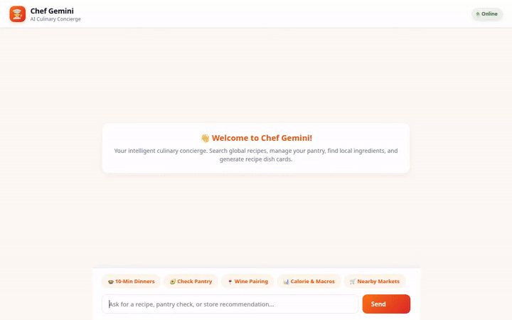

# 👨‍🍳 Chef Gemini Studio — AI Culinary Concierge & Future Food Science Platform



**Chef Gemini Studio** is an advanced AI culinary concierge built with the **Google Agent Development Kit (ADK)**. It combines deep food science, 3D food printing rheology, acoustic levitation drying, mycelium bio-scaffolds, clinical nutrition, global heritage cuisine expertise, and **222 specialized domain tools** with real-time SVG visual radar analytics and cross-session user memory.

---

## 🚀 Wired-Up Capabilities & Google Cloud Services

Chef Gemini integrates directly with the following Google Cloud and Vertex AI services:

* **Vertex AI GenAI (`gemini-2.5-flash`)**: Drives the primary agent reasoning loop, tool orchestration, and adaptive culinary responses.
* **Vertex AI Imagen 3 (`imagen-3.0-generate-002`)**: Generates photorealistic dish cards on demand for any recipe or custom dish (`generate_recipe_photo_card`).
* **Vertex AI Memory Bank**: Provides persistent long-term cross-session memory via `PreloadMemoryTool` and memory generation callbacks, remembering dietary restrictions, user preferences, and culinary history across sessions.
* **Google Cloud Storage (GCS)**: Hosts generated recipe photo card assets in a public storage bucket for high-speed delivery to the user interface.
* **Google Maps Places API**: Performs real-time local searches for specialty grocery stores, markets, and butchers near the user (`search_nearby_grocery_stores`).
* **Agent-to-User Interface (A2UI)**: Renders rich, dynamic UI surfaces (cards, structured component lists, image hero banners) using `A2uiSchemaManager` and `a2ui_callback` rather than plain text alone.
* **A2A (Agent-to-Agent) Protocol**: Exposed via standard Agent Runtime endpoints for seamless proxy forwarding and multi-agent collaboration.

---

## 🛠️ 222 Specialized Culinary Domain Tools

Chef Gemini features **222 dedicated ADK tools** organized into specialized culinary domains:

1. **Molecular Gastronomy & Flavor Physics**: Direct/reverse spherification bath timing, Transglutaminase protein binding, vacuum chamber compression ($<50\,\text{mbar}$), ultrasonic cavitation ($20\,\text{kHz}$), supercritical $\text{CO}_2$ fluid extraction, plant protease digestion, LN2 shatter, hydrocolloid syneresis, GC-MS aroma pairing, and $10,000\times g$ centrifugal clarification.
2. **Modernist Bread, Pastry & Polymer Science**: Baker's math hydration ($55-90\%$), croissant butter block lamination rheology, Lievito Madre sourdough acid balance (lactic:acetic 3:1), macaronage lava-ribbon flow, Isomalt sugar glass transition ($160^\circ\text{C}$), Gelatin Bloom conversion ($g_2 = g_1 \times \sqrt{B_1 / B_2}$), panada egg hydration, chocolate $\beta_V$ crystal seeding, fat crystallization polymorphs, and ovalbumin foam stabilization.
3. **Artisan Fermentation, Koji & Fungi**: *Aspergillus oryzae* koji spore inoculation, thermal enzyme garum proteolysis ($60^\circ\text{C}$), miso salt concentration ($5-14\%$), tsukemono nuka bran bed maintenance, black garlic Maillard chamber ($65^\circ\text{C}$, $85\%\,\text{RH}$), Acetobacter vinegar oxidation, Rhizopus oligosporus tempeh incubation, kombucha SCOBY balancing, lacto-ferment brine math, and wild mushroom foraging safety.
4. **Enology, Spirits & Craft Beverages**: Growing Degree Days (GDD) terroir scoring, Champagne *Méthode Traditionnelle* dosage ($24\,\text{g/L} \rightarrow 6\,\text{bar}$), craft cider tannin-acid balance, bourbon oak barrel char extraction, beer hop IBU utilization ($IBU = \frac{g \times \%_\alpha \times U}{V}$), cocktail thermal dilution, absinthe thujone louche effect, vermouth botanical steeping, Henry's Law $\text{CO}_2$ carbonation, and pot still distillation cuts.
5. **Regional Heritage Cuisines**: Mexican corn nixtamalization ($\text{Ca(OH)}_2$), Indian tadka fat-soluble spice blooming order, Thai curry paste mortar fiber shear, Ethiopian *ersho* teff sourdough fermentation, semolina bronze die extrusion friction, Spanish paella socarrat bottom flame control, Middle Eastern tahini halva crystallization, Japanese ramen *tare/dashi* umami synergy, Escoffier mother sauce roux reduction, and Georgian khachapuri sulguni stretchability.
6. **Clinical & Performance Nutrition**: Ketogenic net carb macro ratios (3:1/4:1), Low-FODMAP fermentable carbohydrate scanning, renal potassium & phosphorus leaching, Glycemic Index/Load response curves, endurance athlete glycogen carb loading ($7-10\,\text{g/kg}$), anti-inflammatory polyphenol density, biogenic amine histamine safety, muscle hypertrophy leucine trigger ($3.0\,\text{g}$), diabetic carb exchange ICR units, and IDDSI texture-modified diet standards.
7. **Butchery, Seafood & Upcycling**: Sashimi-grade Ikejime ATP preservation, beef dry-aging calpain/cathepsin tenderization, whole animal nose-to-tail yield, citrus peel *oleo saccharum* cold sugar extraction, Monterey Bay Seafood Watch rating, brewery spent grain upcycled flour milling, cascara coffee cherry tisane brewing, cricket flour protein incorporation, cell-cultivated meat scaffold searing, and food waste methane offset calculator.
8. **Future Food Science & 3D Gastronomy**: 3D food printing extrusion shear rate, acoustic levitation contactless dehydration, mycelium bio-scaffold fermentation, Pulsed Electric Field (PEF) cell electroporation, sonic acoustic spirits aging, smart sous-vide core probe thermodynamics, bio-fermented ester synthesis, non-contact laser surface caramelization, cold atmospheric plasma sanitization, and High-Pressure Processing (HPP) non-thermal pasteurization.

---

## 📂 Project Structure

```
chef-gemini/
├── app/                       # Core ADK Agent implementation
│   ├── agent.py               # Agent definition, A2UI callbacks, & tool registration
│   ├── tools.py               # 222 specialized culinary domain tools & Imagen 3 card generator
│   └── a2ui_utils.py          # A2UI schema manager & surface update builder
├── frontend/                  # FastAPI Proxy & Modern Web UI
│   ├── main.py                # FastAPI server communicating via A2A protocol
│   └── static/                # Glassmorphic UI with SVG Radar Chart & Clinical Gauges
├── scratch/                   # Unit test suites & validation scripts
│   ├── test_batch_8.py        # Unit tests for Tools 31-100
│   ├── test_batch_9.py        # Unit tests for Tools 101-200
│   └── test_upscale.py        # Unit tests for Upscaled Platform & 222 Tools
├── agents-cli-manifest.yaml   # Manifest for agents-cli deployment & runtime
└── demo.gif                   # Embedded looping demo recording
```

---

## 💻 Local Setup & Execution

### Prerequisites

* Python 3.11+
* `uv` package manager (`pip install uv`)
* `google-agents-cli` (`uv tool install google-agents-cli`)
* Google Cloud SDK with authenticated credentials (`gcloud auth application-default login`)

### Environment Setup

Set your Google Cloud Project and API keys in your environment or `.env` file:

```bash
export GOOGLE_CLOUD_PROJECT="<your-gcp-project-id>"
export GOOGLE_MAPS_API_KEY="<your-google-maps-api-key>"
```

### Running the Agent & Playground Locally

1. Install project dependencies:
   ```bash
   agents-cli install
   ```

2. Run unit tests across all 222 tools:
   ```bash
   uv run pytest scratch/test_upscale.py
   ```

3. Launch the ADK local playground:
   ```bash
   agents-cli playground
   ```

### Running the Web UI Studio

Start the frontend proxy server:

```bash
cd frontend
uv run python main.py
```

The application interface will be available locally on port `8080`.

---

## 🚀 Deployment to Agent Platform

Deploy the agent directly to Vertex AI Agent Runtime:

```bash
agents-cli deploy --project <your-gcp-project-id> --no-confirm-project --update-env-vars GOOGLE_MAPS_API_KEY="<your-key>"
```
